SIEMENS Ingenuity for life

# PID工程调试指南

https://support.industry.siemens.com/cs/cn/zh/view/109978710

## 1. PID控制系统调试前期准备工作

任何控制系统在加入自控系统之前，应该先由工艺工程师确定工艺流程，然后和自控工程师共同制定自动控制方案，自控工程师应该提出相应的建议及意见，减少控制方案出现缺陷的概率，提高工程调试效率，避免不必要的麻烦和错误。同时，自控工程师在项目开始工程调试之前，应该对控制系统进行全面的了解和准备。

### 1.1 PID 控制相关工艺流程的总体了解

#### 1.1.1 工艺对象的物理特性

自控工程师首先应对工艺流程进行了解，这是自动控制的基础，也是完成自动控制的关键。

例子 1：恒压供水 PID控制系统

1. 整体供水回路构成（水源来源，用水特性，水位控制与压力控制的协调，消防用水与生产生活用水的联动关系…）

2. 工频泵的数量（承担系统主要负荷）

3. 变频泵的数量（节能，调节供水压力）

4. 最大供水负荷（确定最大水泵投入数量，保证供水）

5. 最小供水负荷（确定水泵投入数量，优化节能）

6. 膨胀罐状态（减少水锤冲击，提高供水压力品质，减少水泵损耗）

7. 水泵参数（合理分配负荷，避免水泵电机过流）

8. 水泵切换的条件（确定几用几备，调节负荷，平衡使用）

9. 开始供水启动顺序

10. 停止供水停止顺序

11. 工频泵与变频泵的切换条件

通过对以上信息的了解，可见 PID控制只是控制方案中的一个环节，了解其它各个工艺环节的物理特性，完善相关控制方案，是 PID恒压供水的控制的前提。

实际使用工况控制策略优化对 PID控制的影响：

1. 在 8:30 早班生产高峰期，屏蔽 PID恒压掉落延迟后增加水泵数量逻辑，提前切换到2x 工频泵+1x 变频泵低转速状态

2. 在 23:30 后，屏蔽 PID变频器低频运行延迟减少水泵数量逻辑，只保留 1 变频泵供水状态

3. 在消防联动状态，取消供水池预留水位下限限制，恒压供水水压提高 0.1MPa，变频泵切换到工频泵的延迟时间缩短到 10s，取消水泵平衡使用逻辑

重点：从以上控制策略优化可以得出结论，通过对用水量进行分析或者监控，带来的控制系统性能改善，是无法单纯依靠 PID 被动调节得到的。

例子 2：热风烘箱 PID控制系统

1. 烘箱容积：1.5 立方米，加热功率 9 千瓦可调，每次干燥量 60 千克，循环风机，排湿风机 0.75 千瓦各一台

2. 排湿风机工作时间约为 15 秒，可调

3. 干燥物主要为蔬菜

实际使用工况控制策略优化对 PID控制的影响：

1. 根据干燥物品含水量的不同，可人工选择，加热流程及 PID参数相应变化

2. 根据人工选择的结果，确定干燥前期的排湿风机工作次数，每次工作时长，减少热量损失，优化节能

3. 根据排湿风机工作的逻辑，提前对加热系统的 PID控制进行优化补偿，避免温度大幅度波动，保证干燥物品质

4. 根据人工选择的物料种类，数量，不同工况进行加热负荷预判，

#### 1.1.2 明确工艺参数的要求

例子 1：恒压供水系统

供水压力 0.5±0.01MPa,可调

例子 2：热风烘箱控制系统

系统温度 65\~140±2℃可调

### 1.2 系统的整体工况测试

在进行自动控制调试开始之前，先对系统进行全面的工况测试，了解不同工况下的控制需求，对后续的控制策略优化，PID参数整定都具备重要参考价值。

#### 1.2.1 控制系统的特性

例子 1：恒压供水 PID控制系统

1. 变频泵转速，扬程，流量特性图

2. 系统最大流量，时间节点

3. 允许的水泵最低转速

4. 允许的水泵压力上升时间曲线

5. 用户特点与供水量，供水压力关系图

例子 2：热风烘箱 PID控制系统

1. 热烘箱空箱预热，最大加热功率，从室温到设定温度（140℃）所需时间。

2. 热烘箱空箱预热，70% 加热功率，从室温到设定温度（ $( 1 4 0 ^ { \circ } \mathsf { C } )$ 所需时间。

3. 热烘箱空箱已预热（140℃），烘干 60kg 胡萝卜所需排湿时间及次数

4. 热烘箱空箱已预热（ $( 1 4 0 ^ { \circ } \mathsf { C } )$ ，烘干 60kg 西红柿所需排湿时间及次数

5. 热烘箱空箱已预热（ $. 1 4 0 ^ { \circ } \mathsf { C } )$ ，烘干 60kg 胡萝卜重新升温至 $1 3 0 ^ { \circ } \mathsf C .$ 所需时间（80%加热功率）

6. 热烘箱空箱已预热（140℃），烘干 60kg 西红柿重新升温至 $1 3 0 ^ { \circ } \mathsf C .$ 所需时间（80%加热功率）

7. 热烘箱空箱已预热 $( 1 4 0 ^ { \circ } \mathsf { C } )$ ，烘干 60kg 胡萝卜重新升温至 $1 3 0 \%$ 所需时间（100%加热功率）

8. 热烘箱空箱已预热（ $( 1 4 0 ^ { \circ } \mathsf { C } )$ ，烘干 60kg 西红柿重新升温至 $1 3 0 ^ { \circ } \mathsf C .$ 所需时间（100%加热功率）

9. ……

重点：通过对以上工况的不同测试，可以优化系统的控制特性，提前进行预判，控制加热器及排风电机，先将系统稳定在合适的工作状态，例如 $1 3 0 \%$ ，再投入 PID控制策略，并选定不同的 PID 参数，保证烘干过程的快速，节能，产品品质等需求。

#### 1.2.2 确认工艺系统的安全边界

控制系统的安全边界是指一系列预先设定的参数范围，这些参数范围用于确保系统能够安全、稳定、高效地运行。当系统运行参数接近或超出这些边界时，控制系统会采取相应的措施进行调整或报警，以防止设备损坏、控制故障或其他安全事故的发生。

例子 1：恒压供水系统

1. 变频泵最低允许运行频率

2. 管路堵塞的状态下，变频器允许的最高运行频率

3. 最小允许压力上升斜坡时间

4. 最大失压容限时间

例子 2：热风烘箱控制系统

1. 系统 100%加热功率，空箱升温曲线高限

2. 设备最高限制温度

3. 物料最高限制温度

重点：通过对工艺系统不同工况下的测试，在工艺安全参数给定的范围之外，例如温度，压力，流量等等的高限与低限，可以得到相对应的自控系统的安全边界，这些边界值是自控过程中务必不可超越的危险范围，务必以最高优先级体现在自控逻辑当中。

### 1.3 自控系统控制方法的选择

从之前的章节内容可以得出结论，自控系统的控制方法，主要受工艺要求的影响，工程师对系统物理特性的理解，是选定控制方法的依据。PID作为一种控制方法，并不能完成所有的控制任务需求。

#### 1.3.1 PID 控制方法的适用范围

说明: 参照 PID控制公式，PID控制方法必须可以用数学模型进行体现，PID的输出与过程控制变量之间要有确定的对应关系，为线性系统，例如一阶系统，二阶系统等，系统的输入及输出符合叠加原理，输出可以线性计算，不具备不确定性。 相关的理论请用户自行查询。对于非线性系统，复杂的动态系统（例如工况变化不确定，负载特性变化不确定的系统），PID控制方法不适用。

重点：即使在 PID 调节适用的系统，负荷的大范围变化，工艺要求的变化，也需要先通过预先的控制调节，在工况适于投入 PID 控制的状态下，才通过 PID 进行控制调节（参见 1.2 章节中的例 1 及例 2）。

#### 1.3.2 PID 系统的初步测试

可以使用 PID 调节的系统，对于工程师来讲，也各不相同，在进行 PID调节之前，工程师需要先对系统进行评估：

评估步骤：

1. 在保证过程变量不超上限，工艺系统安全的情况下，把输出可以给定的最小值进行输出，例如 10%

2. 在保证过程变量不超上限，工艺系统安全的情况下，把输出可以给定的中值 1 进行输出，例如 40%，记录系统特性，例如上升时间，过程变量稳态数值，并查看稳态值与常用设定值之间的关系。

3. 在保证过程变量不超上限，工艺系统安全的情况下，把输出可以给定的中值 2 进行输出，例如 60%，记录系统特性，例如上升时间，过程变量稳态数值，并查看稳态值与常用设定值之间的关系。

4. 在保证过程变量不超上限，工艺系统安全的情况下，把输出可以给定的最大值进行输出，例如 90%，记录系统特性，例如上升时间，过程变量稳态数值，并查看稳态值与常用设定值之间的关系。

5. 记录最小负荷时，系统达到稳态的输出值

6. 记录最大负荷时，系统稳态的输出值

#### 7. 物料最高限制温度

经过这些评估工作，工程师将对系统有一个大概整体的认识，包括系统设定值、输出值、过程值之间的关系，系统闭环的基本构成等等。

## 2. PID基础理论

关于 PID理论的资料非常多，本文不做赘述，用户可自行查阅，此处仅讨论本文相关的基础PID公式及方法。

### 2.1 本文基于的 PID 公式

最常见的 PID 公式，理想型 PID 公式：

$$
u (t) = K p [ e (t) + \frac {1}{T _ {i}} \int_ {0} ^ {t} e (t) d t + T _ {d} \frac {d e (t)}{d t} ]
$$

相关说明：

e(t)=Psetpoint-Pv ：差值（国内大部分资料都称此值为误差或偏差，其实严格来讲，不符合误差的定义，使用差值一词更合适）

Psetpoint: 设定值

Pv： 过程值

Kp:比例增益

Ti：积分时间

Td：微分时间

最常见的 ZN 整定法中使用的参数（下表中的 K,Ti,Td, 即对应理想型 PID 公式中的 Kp,Ti,Td），例如：

<table><tr><td>控制器</td><td>K</td><td>Ti</td><td>Td</td></tr><tr><td>P</td><td>0.5Ku</td><td></td><td></td></tr><tr><td>PI</td><td>0.4Ku</td><td>0.8Tu</td><td></td></tr><tr><td>PID</td><td>0.6Ku</td><td>0.5Tu</td><td>0.125Tu</td></tr></table>

注意 1：一个常见的错误就是，大家讨论 PID， 但又基于不同的公式，只看数值，不看定义，例如：把 Ti=3（积分时间），和 Ki=3 （积分系数）混淆，实际上两者之间的对应关系为：Ki=1/T注意 2：

本文所提及的 Kp,Ti,Td，都严格基于 PID 理想型公式，而不引用其它方式，例如： Ki 积分系数，Kd 微分系数等概念，如果期望使用其它类型的公式，请根据不同公式定义的格式，自行转换。

相对于经典的 PID 公式，计算机或 PLC 更多的是使用增量 PID离散算法：

$$
\begin{array}{l} {u _ {(k)} = k _ {p} (e r r _ {(k)} + k _ {i} \sum e r r _ {(j)} + k _ {d} (e r r _ {(k)} - e r r _ {(k - 1)})) ^ {\psi}} \\ {\Delta u _ {(k)} = k _ {p} (e r r _ {(k)} - e r r _ {(k - 1)}) + k _ {i} e r r _ {(k)} + k _ {d} (e r r _ {(k)} - 2 e r r _ {(k - 1)} + e r r _ {(k - 2)}) ^ {\psi}} \end{array}
$$

注意 3：对于理想型 PID 公式，由于比例分量，积分分量，微分分量，都最终会乘以 $\mathsf { K p } ,$ 这样会造成积分分量和微分分量与 $\mathsf { K p }$ 的强耦合关系，不利于对每个分量概念的分析与理解，所以本文附带的 PID 理论仿真工具，实际上的公式为：

$$
u (t) = K p e (t) + \frac {1}{T i} \int_ {0} ^ {t} e (t) d t + T d \frac {d e (t)}{d t}
$$

调整Ti，及 Td 时,免除了Kp 系数的影响。

### 2.2 PID 参数解读

#### 2.2.1 P 参数解读

在本文附带的 PID 特性模拟工具中，可以通过对不同参数的调整，来理解 PID中各个分量对PID输出的贡献，例如当设置参数为： $\mathsf { P s e t p o i n t : } = 0 . 8 , ~ \mathsf { K p } = 1 . 2 9 , ~ \mathsf { P } = \mathsf { K p } ^ { \star } \mathsf { e }$ ，如图 1 所示，当设定值为 0.8（80%），过程变量 $\mathsf { P v }$ （深红色曲线）变化时，其与设定值 Psetpoint（蓝色直线）的差值为 e(绿色曲线)，P 分量(紫色曲线) $\mathsf { \Pi } = \mathsf { e } ^ { \star } \mathsf { K } \mathsf { p }$ o

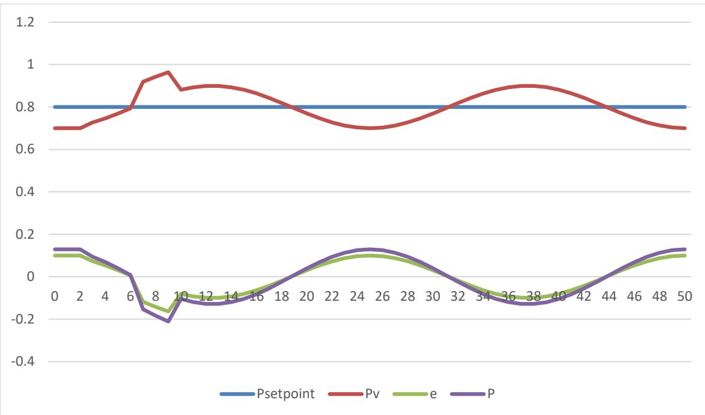

图 1 P 分量曲线

#### 2.2.2 I 参数解读

类似于 P 分量，当设置参数为：Psetpoint:=0.8，Ti=14s,如图 2 所示，当设定值为 0.8（80%），过程变量 Pv（深红色曲线）变化时，其与设定值 Psetpoint（蓝色直线）的差值为e(绿色曲线)，I 分量(紫色曲线)为

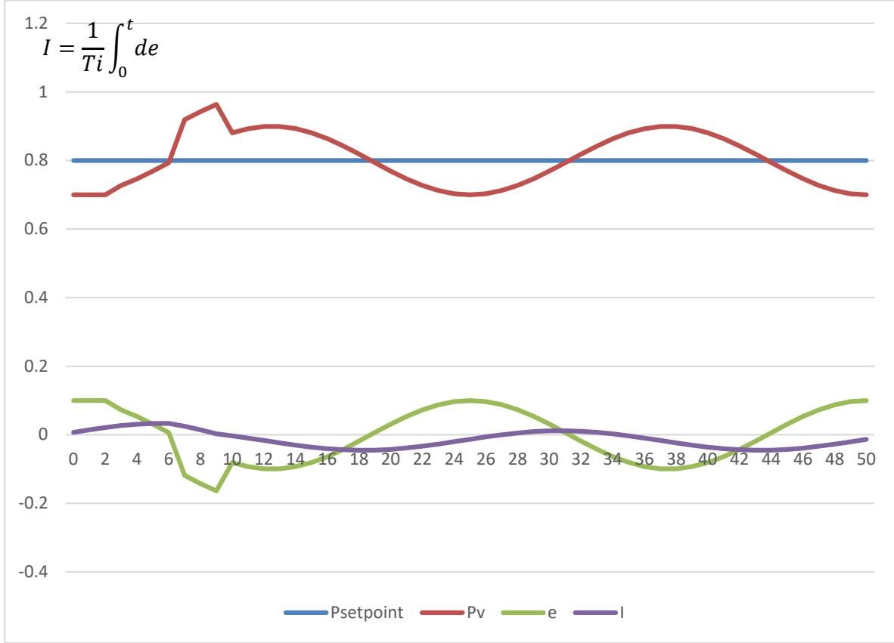  
图 2 I 分量曲线

#### 2.2.3 D 参数解读

类似于 P 分量，当设置参数为：Psetpoint:=0.8，Td=2s,如图 3 所示，当设定值为 0.8（80%），过程变量 Pv（深红色曲线）变化时，其与设定值 Psetpoint（蓝色直线）的差值为

e(绿色曲线)，D 分量=Td\*de/dt(紫色曲线)。

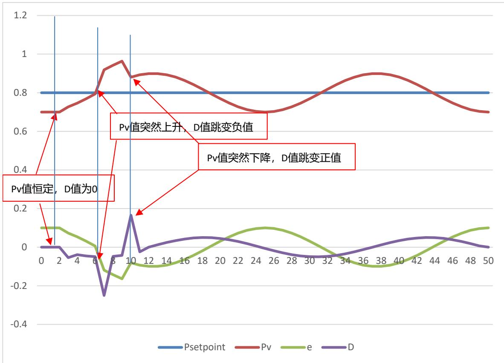  
图 3 D 分量曲线

#### 2.2.4 PI 响应与 PID 响应

类似于 P 分量，当设置参数为：Psetpoint:=0.8，Td=2s,如图 3 所示，当设定值为 0.8（80%），过程变量 Pv（深红色曲线）变化时，其与设定值 Psetpoint（蓝色直线）。

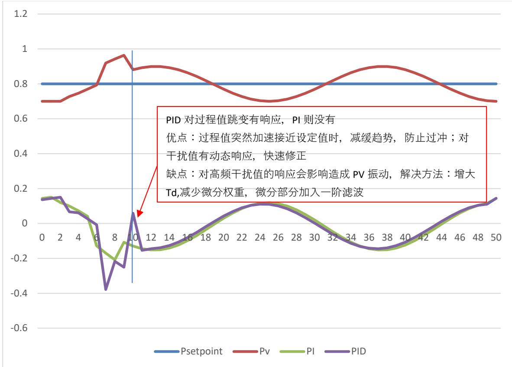  
图 4 PI 曲线与 PID 曲线对比

#### 2.2.5 各种PID公式的改良版本

参照 2.2.4 章节，PID 调节中的 D 分量既有优点又有缺点，所以基于理想型 PID 公式，西门子的 S7-1500 及 S7-1200 系列，实际使用的是改良版的 PID公式，见下图，在 D分量中增加了低通滤波环节。

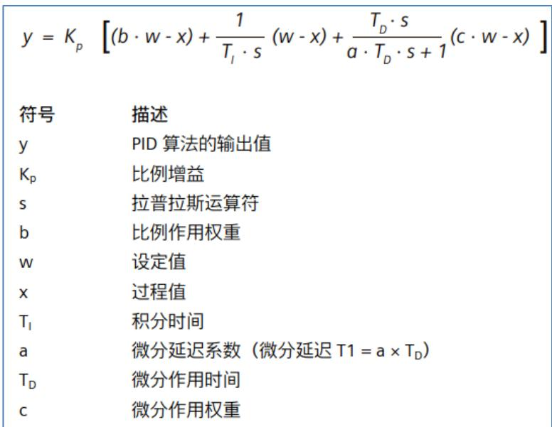  
图 5 改良版的 PID 功能

### 2.3 PID阶跃响应自整定

#### 2.3.1 传统理论的阶跃响应整定

在很多 PID 整定的资料中，都讲述了通过给出 100%的系统阶跃输出，从而通过评估系统响应来确定 PID参数的方法，但此方法在工程实践中是否适用呢？

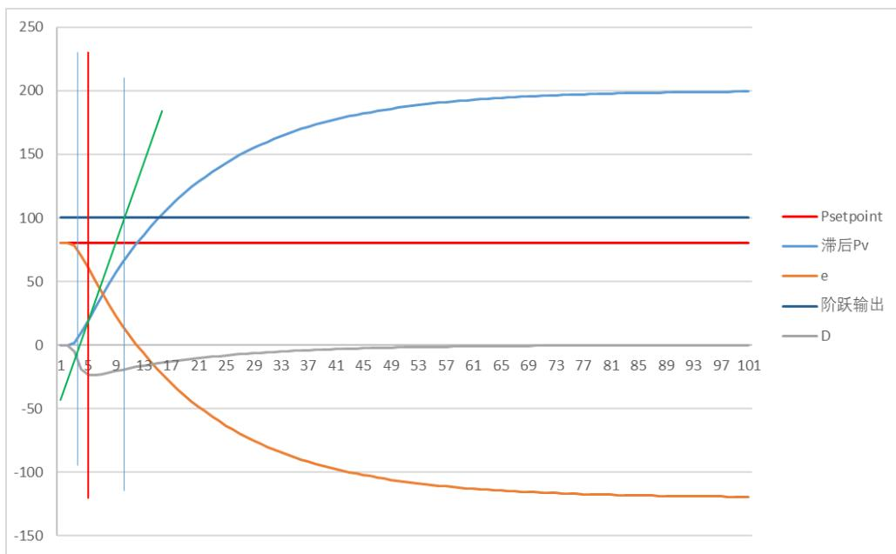  
图 6 100%输出的系统响应曲线

首先，从图 6 中可以看到，在系统给出 100%输出后，系统过程值最终稳定在了 200%的位置，但在很多实际工程项目中，此操作可能会导致过程值超出了安全值，是被严格禁止的；其次对于输出设备，突然输出 100%的数值，对于执行器及设备管路等等来讲，都是非常大的考验，对设备的寿命有很大的影响，同样是被禁止的；再次，很多执行器从 0 达到 100%输出，都是要有一个过程的，在此期间的时间如何从图中评估？如果无法评估，100%的实际物理输出，如何突然连接或给定到负载上？

实际上，受制于执行器件的特性，以及被控对象的 物理特性，PID的输出值即使是 100%，这个 100%的数值也是无法从所谓 0 时刻，就施加在过程值上的，所以理论上常见的 100%系统输出阶跃响应整定的方法，在实际操作的时候，很可能如 图 7 所示，例如输出值是 100%，但由于执行器件无法立刻变为 100%（例如本例中电动调节阀门从 0 时刻到完全打开，用时 9 秒，具体其它工程项目中的情况，有可能比这个时间长，也有可能比 这个时间短。），真实的物理输出量是按照一个斜坡曲线上升的。过程变量起始受到的作用也并非是 100%的输出量，而是一个逐渐增大的物理输出量，过程值经过一段滞后的过程，再逐步上升，此时如果按照理论上的阶跃响应法去测算 PID参数，则会产生非常大误差。

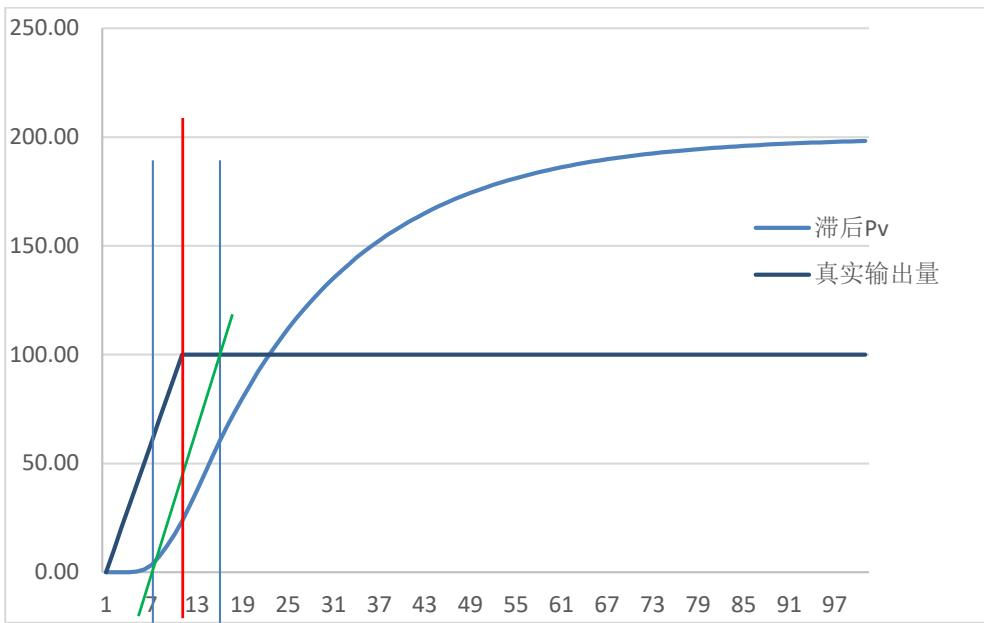  
图 7 常见阶跃响应曲线  
从上面的问题，我们可以得出如下结论：

1. 尽量不要使用 100%阶跃响应输出来评估系统特性

2. 阶跃响应评估系统特性得到的参数偏差会比较大

#### 2.3.2 改进的阶跃响应整定方法

下面介绍改进的阶跃响应评估方法：有限阶跃输出评估方法，见图 8，

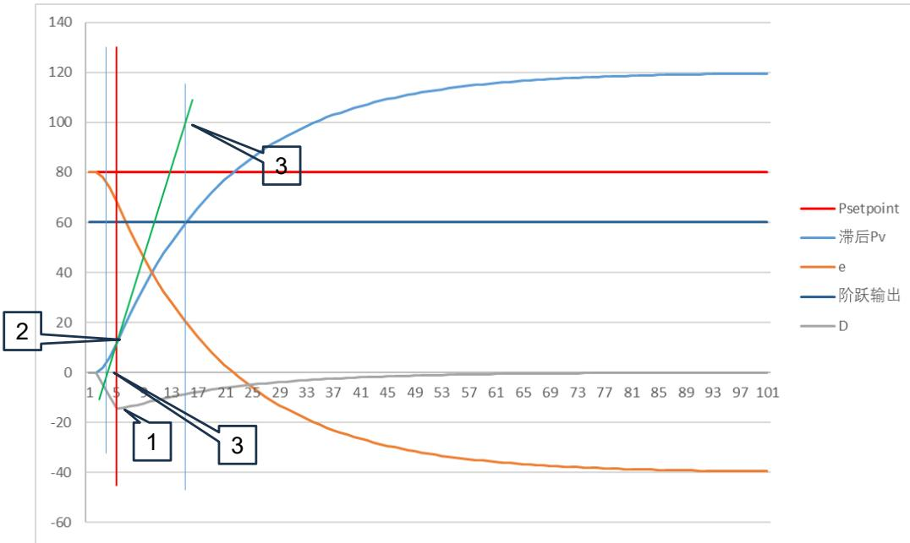  
图 8 有限阶跃输出的系统响应曲线

在图 8 中，通过给定一个相对合理的阶跃输出 60%，系统过程变量 Pv 最终稳定在 120%，接近系统允许的上限（此处数值用户可以根据实际情况，自行设定及测试）。通过系统响应曲线，通过如下步骤得到系统特性：

1. 找到 D分量的拐点，为 5s 的位置，放置一条直线，与过程变量相交，交点处即为Pv 上升率变化点

2. 交点位置放置切线，切线与 Y 轴的 0 点及 100 相交

3. 在两个交点处放置直线，与 X 轴相交，

4. 此两个交点在 X 轴上对应的数值即为系统的两个重要参数τ, Tg

τ ：系统延迟时间 Tg: 系统恢复时间，参见图 8 的局部放大 图 9

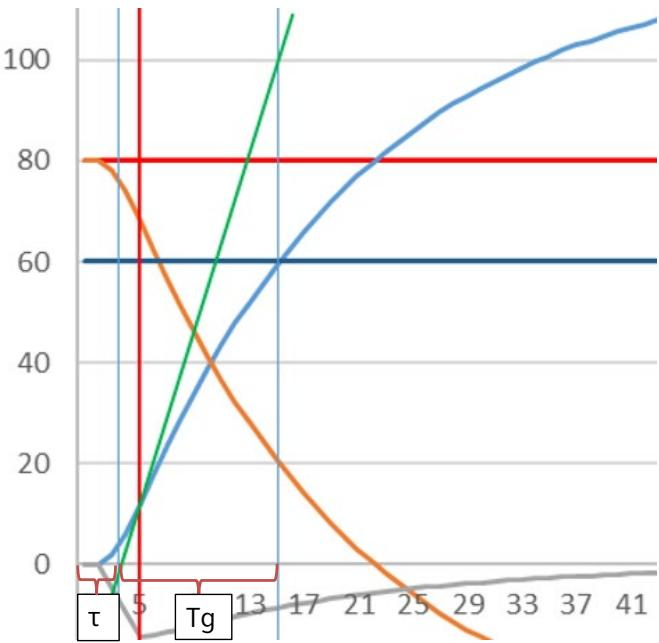  
图 9 参数 τ 及 Tg 的获得

系统的 PID 参数可以按照如下公式给出：

$$
\mathrm{Kp} = 0. 5 3 ^ {*} \mathrm{Tg} / \tau \quad \mathrm{Ti} = 4 ^ {*} \tau \quad \mathrm{Td} = 0. 8 ^ {*} \tau
$$

初步得到的 PID 参数 Kp=2.12，Ti=12，Td=3.2

在此基础上，工程师可以根据实际系统特性，自行尝试修改 PID参数，得到自己需要的结果。

#### 2.3.3 对阶跃响应整定方法错误认识

对传统理论阶跃响应参数整定的错误认识：

很多工程师在使用传统理论阶跃响应法得到 PID参数后，不结合任何控制策略，就直接在PID控制中使用，例如：在过程变量初始值为 0%时，直接给定一个 80%的设定值。此行为会导致PID过程中的积分饱和，P 分量也会非常大，最终导致输出达到上限（满功率输出），过程变量超出设定值并过冲。此行为不仅仅有一定的工艺危险，对控制设备也是非常不友好的（如图 10，Kp=1.767，Ti=12，Td=2.4）。

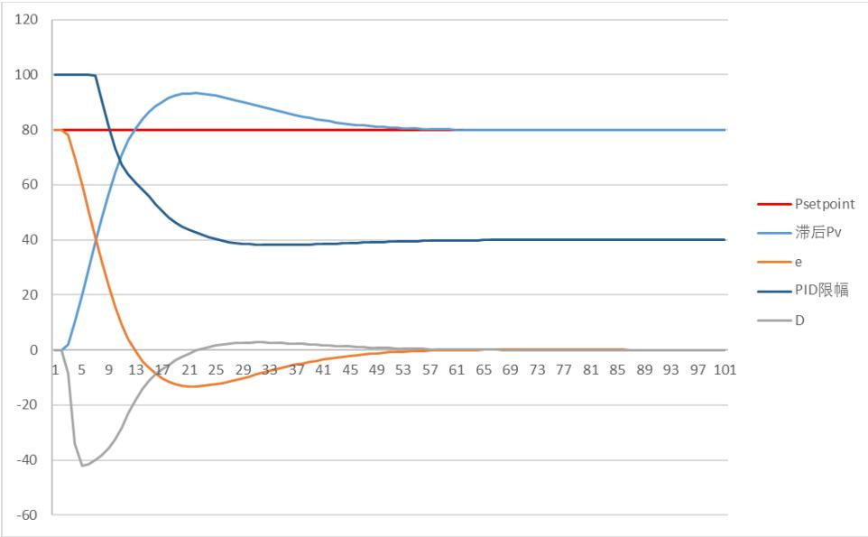  
图 10 “超调”的 PID 曲线

基于上述问题，有些工程师可能认为之前整定得到的 PID参数不准确，应该将 PID 参数进行调整，增大 Ti，削弱积分效果（参见图 11，Kp=1.767，Ti=30，Td=2.4）

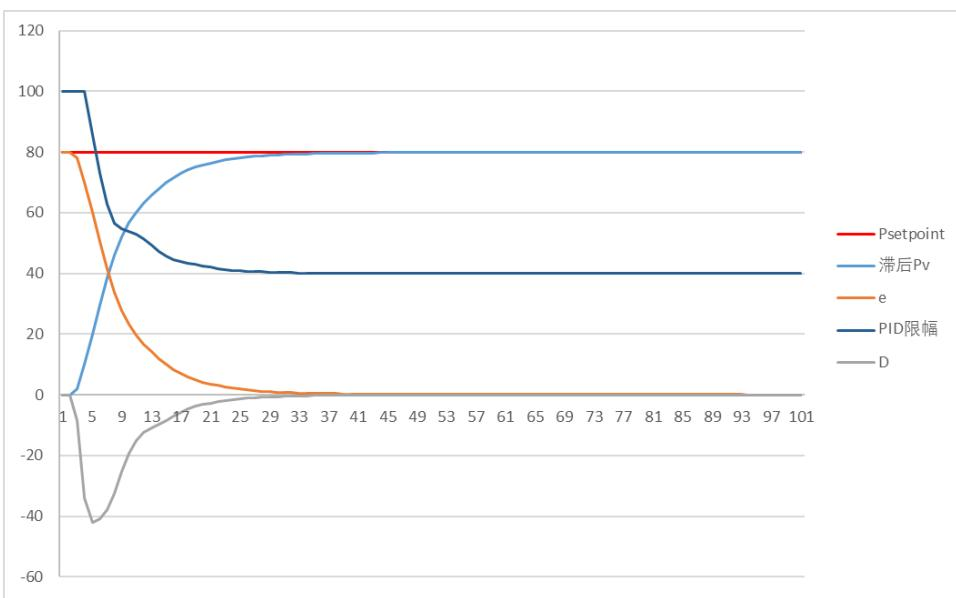  
图 11 削弱 Ti 的 PID 曲线

虽然此曲线会变得“让人满意”，但最终在其它工况时（实际工况过程值从 60%到设定值 80%曲线），系统特性又会变软，达不到控制要求（参见图 12，Kp=1.767，Ti=30，Td=2.4）。

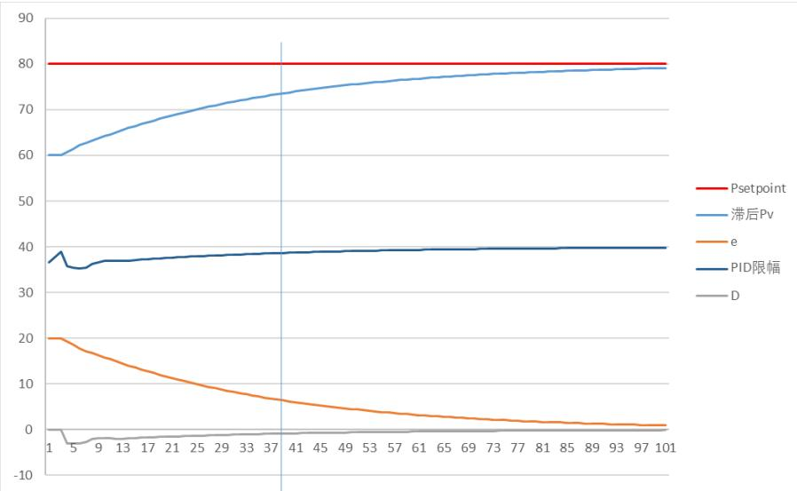  
图 12 PID 实际工况过程值从 60%到 80%曲线

工程师此时如果只是把精力投入在修改 PID 参数上，即使经过反复尝试，最终会发现 PID 参数始终无法满足多设定值工况下的控制要求，从而对 PID 参数整定方法失去信任，甚至对 PID 方法产生怀疑，这些都是错误的。

重要提示：

1. 阶跃响应测试曲线仅仅是为了得到系统的 PID 基本参数，不应用于设定值给定

2. PID 参数需要根据不同工况，进行优化

3. PID 控制需要与其它的辅助方法和策略进行结合

具体内容请参考 3.2 章节。

### 2.4 是否可以使用PID：重要的参数λ

前面的章节提出了系统的两个重要参数：

τ ：系统延迟时间 Tg: 系统恢复时间，

而这两个参数的比值 $\lambda { = } \tau / \top \mathfrak { g }$ ，是 PID系统的一个重要特性参数，一般来讲，

1. $0 < \lambda < < 1$ , 系统滞后性非常小，PID控制起来会很容易，参数可以变化的范围非常大

2. $0 { < } \lambda { < } 1$ , 系统具有滞后性，PID控制需要调试，参数可以变化的范围不大

3. $\lambda { > } 1$ , 大滞后系统，PID调节困难

4. λ>>1, 超大滞后系统，不要使用 PID控制方法

下面通过举例来说明 λ对系统特性的影响：

当 λ接近 0的时候，PID系统几乎没有滞后，此时 PID参数可以给定非常大的范围，而且总是可以得到“完美”的控制特性曲线，图 13 中的 PID 参数：Kp 最大甚至可以给定到 10，系统才开始有振荡趋势，Ti=900（关闭积分），Td=0（关闭微分）

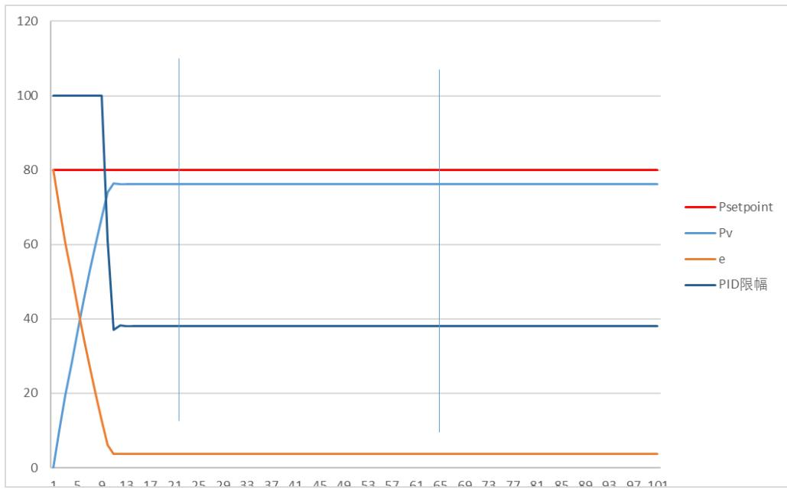  
图 13 λ接近 0 的 PID 系统曲线 1

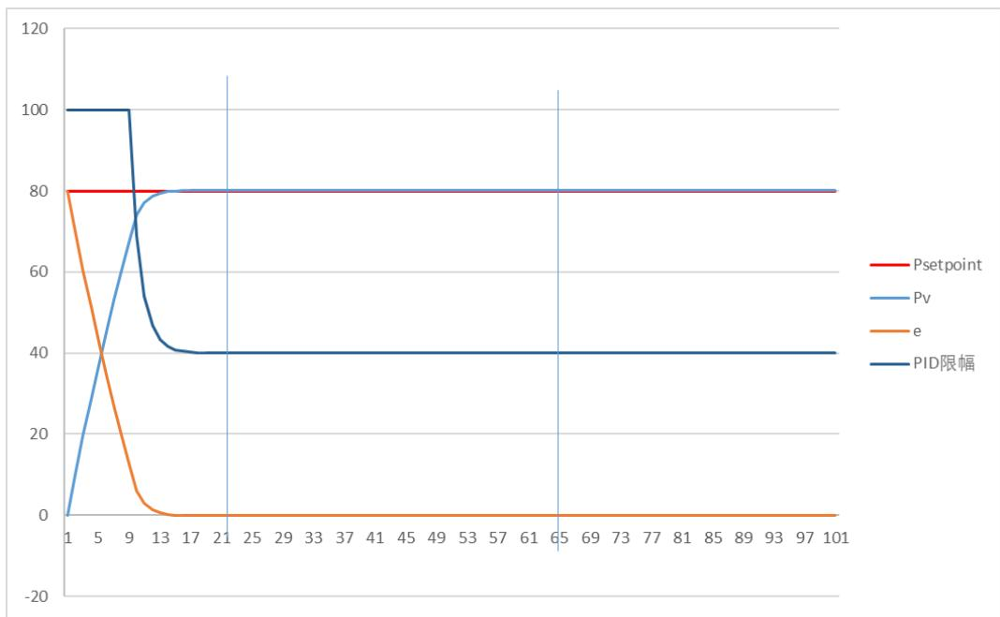  
图 14 λ接近 0 的 PID 系统曲线 2

图 14中的 PID参数：Kp=7，Ti=10，Td=2，系统响应非常迅速，无超调，无振荡，曲线完美，工程师在调节这样特性系统的时候，几乎很难调试失败（当然，这样的系统比较少，多数系统为 0<λ<1）。

#### 阶跃响应法的局限性：

1. 系统的大幅度阶跃输出，在很大实际系统中不被允许

2. 执行器件与物理模型无法实现输出突然从 0 到 100%给定到受控对象，τ评估误差大

3. 阶跃响应曲线的切线评估法 Tg 误差较大

4. 实际生产中的干扰因素排除困难

总结：阶跃响应法存在一些固有的局限性，从而也限制了其使用，此方法更适合简单评估系统的 λ参数，学习，了解系统的物理特性，如果用于工程实践，需要工程师手动调节参数的过程会比较长。

### 2.5 适合工程项目的PID参数的手动调整方法

通过前面的介绍，此时用户应该已经获得了如下信息及方法：

1. 通过阶跃响应法，评估系统是否可以使用 PID 方法

2. 通过改进的限幅阶跃响应法，初步得到 PID参数

3. 得到的参数可能有较大偏差

4. 参数只是参考值，可以进行手动调节

其它手动需求 PID参数或整定的方法有很多，例如等幅振荡法，1/4振荡法，1/10振荡法等等，当然用户也可以使用最原始的参数尝试的方法(Ti=非常大的数值，Td=0，Kp从非常小的数值开始，尝试，逐渐给大，在系统有振荡的趋势后，再改小 Ti参数，Td 逐步增大，直至略有超调…)，从作者的角度来看，可以结合此原始方法，并给出 PID参数手动调整的改良方法。

首先讨论一下等幅振荡法 $\scriptstyle ( 1 \times \mathsf { p } = 7 , \mathsf { T i } = 9 9 9 9 , \mathsf { T d } = 0 )$ ，在纯比例控制的情况下，系统图形如下：

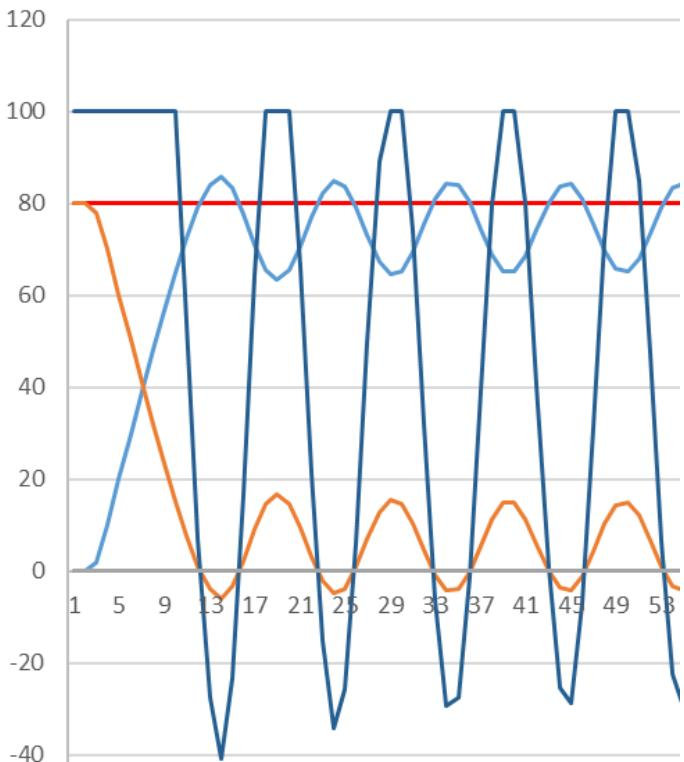  
图 15 等幅振荡法 PID 系统曲线

从图中可以看出，过程值接近等幅振荡，但此时系统的输出值也在做大幅度的振荡，在很多实际系统中此情况受制于系统的工艺特性和物理特性，是不被允许的！

其次讨论一下 1/4振荡法（包括类似的 1/10振荡法），此系统参数 $\scriptstyle ( 1 \land p = 4 , T \land = 9 9 9 9$ Td=0），在纯比例控制的情况下，系统图形如下：

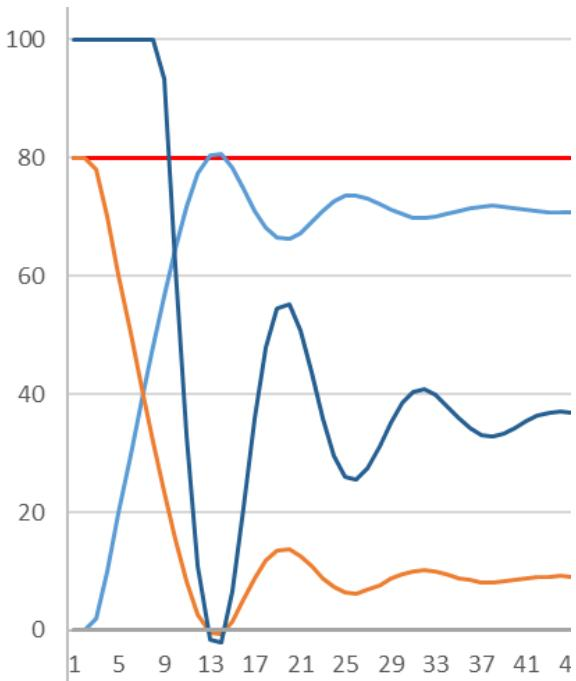

图 16 1/4 振荡法 PID 系统曲线

从图中可以看出，过程值的第二个波峰，接近于第一个波峰的 1/4值，但系统的输出值也存在较大幅幅度的振荡，而两个波峰幅值比为 1/4，也难以精准掌控，再通过经验公式，得到相关的 PID参数大概率存在较大偏差。

无论是通过图 8，还是 图 16，可能都会得到一个初步的 PID参数，例如： $\ K _ { \mathsf { P } } { = } 2 . 1 2$ Ti=12，Td=3.2，那么这个参数如何调整呢？

下面介绍一下，PID参数手动调节的方法：取消积分，微分作用（Ti=9999，Td=0），查看$\mathsf { K p }$ 的上限值，先写入 $K _ { \mathsf { P } } { = } 2 . 1 2 ,$

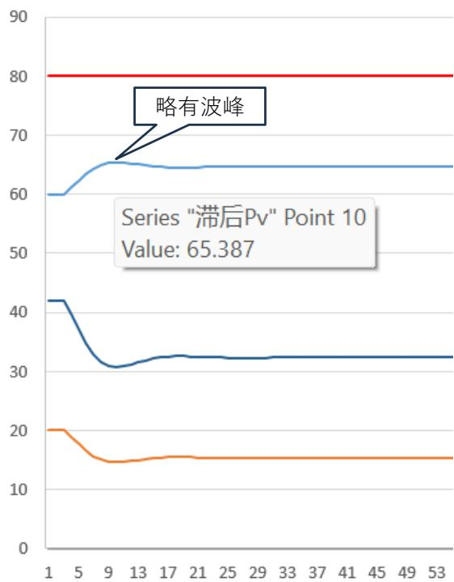  
图 17 P 临界阻尼的过程值曲线

临界阻尼在对控制精度和稳定性要求都很高的场合非常重要。比如在高精度的数控机床的位置控制中，刀具需要精确地移动到指定位置，任何超调或者振荡都可能导致加工精度下降。通过调整 PID 参数使系统处于临界阻尼状态，可以确保刀具快速且准确地定位，提高加工质量。

此时的 Pv值已经接近临界阻尼状态，略有波峰出现，说明此时的 $\mathsf { K p }$ 已经为上限值，不可以再增大，下图中 $\ K p { = } 3 ,$ , 为不可取数值

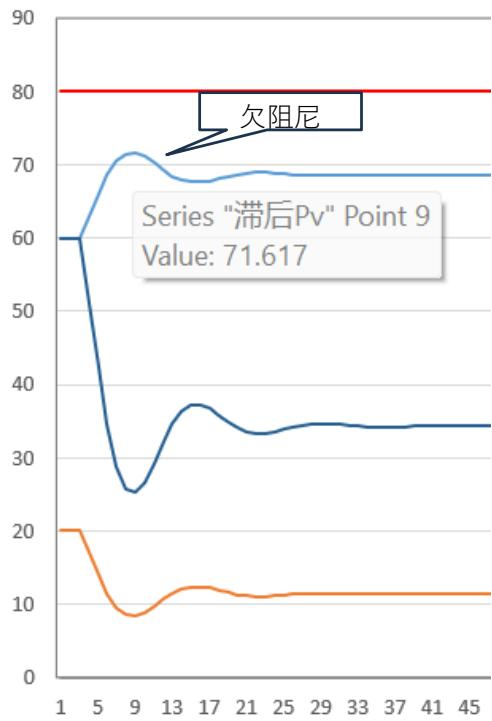  
图 18 P 欠阻尼的过程值曲线

在一些对响应速度要求较高的系统中，适当的欠阻尼是可以接受的。例如，在某些快速响应的电机控制系统中，允许一定程度的振荡可以使电机更快地达到新的转速设定值。但是，需要注意控制欠阻尼的程度，因为过度的振荡可能会导致系统不稳定、增加能量损耗或者损坏设备。通常可以通过观察阶跃响应曲线的振荡幅度和振荡周期，调整 PID 参数来控制欠阻尼程度，使其在满足响应速度需求的同时，尽量减小振荡对系统的不利影响。

取消积分，微分作用（Ti=9999，Td=0），查看 Kp的下限值，逐步按照 20%减小 Kp值，直到过程值略有上升，逐渐平直，过阻尼状态，此处可以得到 Kp下限值为大于 1.5。

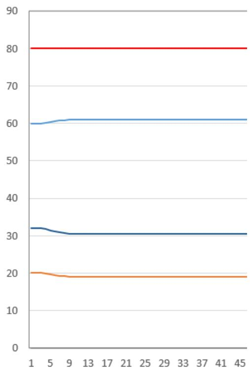  
图 19 P 过阻尼的过程值曲线

最终在常见工况下，我们选定 $\mathsf { K p } { = } 2 . 0$ ，然后再输入之前的 Ti=12，Td=0,如图 20，此时的Pv 值特性偏软，处于过阻尼状态，应该将 Ti 逐渐减小，

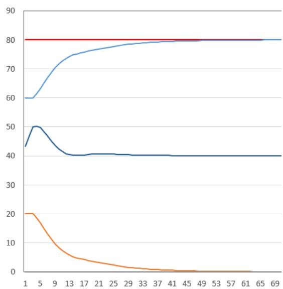  
图 20 PI过阻尼的过程值曲线

过阻尼在一些对稳定性要求极高、对响应速度要求不高的场合可能会被采用。例如，在一些大型储液罐的液位控制中，为了避免液位波动过大对罐体结构造成损害，可能会允许系统以较慢的速度进行调整，采用过阻尼控制。但是，在大多数实际应用中，过阻尼的响应速度过慢可能无法满足生产效率等要求，所以通常需要适当调整 PID 参数来避免系统处于过阻尼状态。

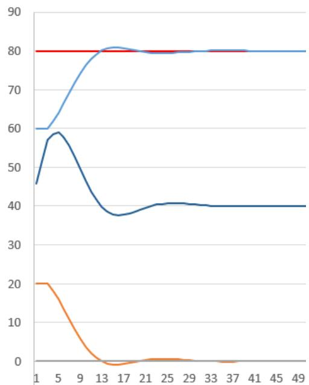  
图 21 PI 接近临界阻尼的过程值曲线

最终 Ti=7的时候，接近临界阻尼，并略有尖峰，得到 Ti下限。如果只使用 PI控制，则此时参数范围为 Kp:1.5-2.0, Ti:大于 7， Td=0;

如果使用 PID 控制，则此时参数范围为 Kp:1.5-2.0, Ti:大于 7， ${ \mathsf { T } } { \mathsf { d } } { = } 1 . 7 5$ （Td的调节方法类似 Ti, 不再赘述）;

在拥有明确的 PID 参数范围后（Kp:1.5-2.0, Ti:大于 7， Td=0），用 $\dot { \mathsf { H } }$ 可以跟据控制工艺的需求，选择相应的组合，希望响应快，就选择大一些的 $\mathsf { K p , }$ , 小的 Ti；如果希望不超调，就选择小一些的 $\mathsf { K p , }$ 大一些的 $\bar { \mathsf { I i } } _ { \circ }$ 。如图 22 中的参数为： $K _ { P } = 2 . 0 , T _ { 1 } = 9$ $\uparrow { \mathsf { d } } { = } 2$

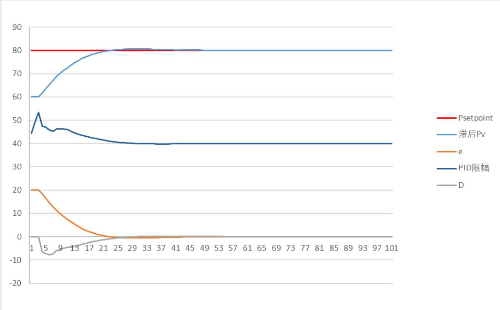  
图 22 根据工况择优的 PID 参数曲线

### 2.6 PID继电器振荡自整定

在之前的章节中已经讲解了阶跃响应法整定 PID参数，阶跃响应法存在一些固有的局限性，从而也限制了其使用，作为一种改进的方法，继电器振荡自整定方法在工程实践中更具备实际价值，相关理论请用户自行查询，本文不再赘述。相关西门子软件的使用方法比较简单（继电器振荡自整定被称为 PID精确调节），请用户参照章节 7中相关资料自行学习，本文不再赘述。

继电器法整定的注意事项：

尽量选取实际常用设定值的 60-80%的数值，作为整定值，否则整定出来的 PID参数在实际工况下，意义不大！

举例说明：

在不同的设定值下，负载的物理模型其实是不同的，以加热系统举例，

1. 加热系统处于室温，此时系统的热量流失为 0

2. 随着系统温度的升高，系统的热量流失逐渐增大，最终加热和散热达到平衡，系统温度就不会再无限制上升

3. 在系统当前温度不同的情况下，上升曲线和下降曲线也是不同的

假设加热系统常用工况为 260摄氏度，如果工程师在 120摄氏度进行继电器整定，然后把得到的 PID参数应用到 260摄氏度工况，如何能保证系统达到满意的控制效果？

继电器法整定的优点：

1. 整定过程中没有过程变量的大幅度阶跃，对系统冲击小

2. 整定过程为多个振荡周期，最终结果为几个周期的计算平均值，准确度高

3. 对系统扰动有过滤机制，容错度高，成功率高继电器法整定的缺点：

1. 整定过程需要过程值多次“穿过”设定值，对于某些系统（散热特性差的加热炉）应用困难

2. 由于整定过程需要经过多个过程用以测试系统响应，包括多次方波激励、跌落调节测试，所以整定过程时间比较长，对于慢速响应系统，整定时间会达到十分钟级别或更长，参见图 23。

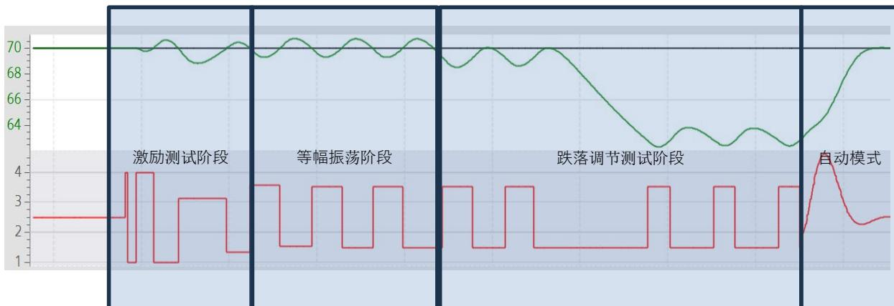  
图 23 典型精确调节过程

3. 在长时间的整定过程中，如果系统的过程变量还存在大扰动（例如供水系统中出现大的用水用户），整定失败的概率会急剧上升，如果系统工况始终得不到改善，则无法完成整定过程，得不到 PID整定参数，参见图 24。

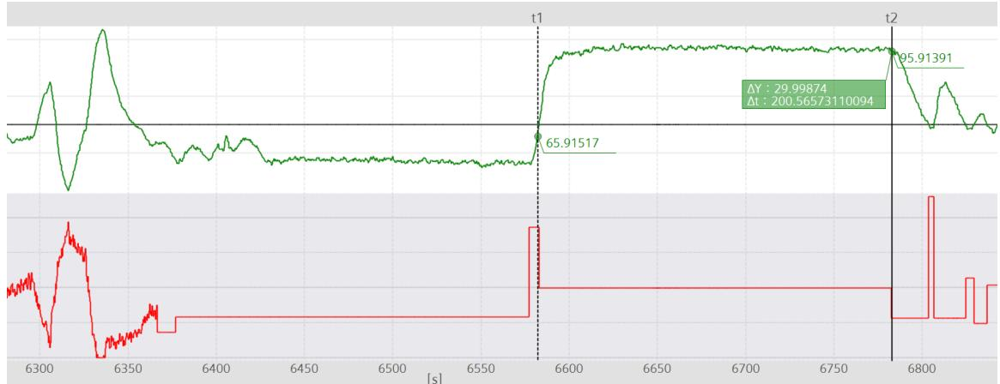  
图 24 系统扰动及负载变化导致精确调节失败

从大多数的工程实践结果统计来看，继电器法自整定成功的概率还是很高的，但如果出现上面整定失败的情况，如何处理？请参阅本文的 4.3章节。

## 3. PID工程调试

### 3.1 PID 工程调试过程

在工程师进行 PID 技术交流的时候，经常会有一个有趣的现象，就是彼之 PID,非吾之 PID，最后讨论的结果非常模糊和不确定，你的经验我感觉不对，我的经验你感觉好像也有问题，大家好像有共同的理论，又好像不是。同样的理论为什么会有不同的实践结果？好像每个 PID项目都不同，完全依赖工程师的经验，准备的理论无处应用。

#### 3.1.1 PID的纸上谈兵和真刀真枪

通过之前的章节，用户应该已经已经具备了“纸上谈兵”完成 PID调节的能力，但一旦进入 项目工程调试，很多工程师又会有些不知如何将理论和实践结合起来。为什么会存在这样的问题？我们通过任务描述先进行一下比较：

理论任务：将一个滞后 5s 的，输出作用系数 K 为 10 的系统 PID 调节到过程值稳定在 80%

工程任务：将供水压力稳定在 0.45Mpa

可以看出，理论模型及经验应用到工程任务，还有一些路要走，工程任务隐藏了很多差异信息，如何将这些信息明朗化，我们将通过一些步骤，将其中的关键节点讲清楚，逐步完成完全过渡。

#### 3.1.2 第一步：共同的理论基础，统一参照的公式

虽然在之前的 2.1 章节，已经明确了本文的 PID理论公式基础，但此处再次强调一下理论基础，否则很多工程实际问题将会失去讨论的基础：

本文基于理想型 PID公式对 PID展开讨论，即

$$
u (t) = K p [ e (t) + \frac {1}{T _ {i}} \int_ {0} ^ {t} e (t) d t + T _ {d} \frac {d e (t)}{d t} ]
$$

如果用户习惯使用如下公式，则相关对应关系为：

$$
u (t) = K p e (t) + K i \int_ {0} ^ {t} e (t) d t + K d \frac {d e (t)}{d t}
$$

$$
\mathrm{Ki} = \mathrm{Kp} / \mathrm{Ti}, \mathrm{Kd} = \mathrm{Kp} ^ {*} \mathrm{Td},
$$

注意：本文统一讨论 Kp, 积分时间 Ti，微分时间 Td, 而不是 Ki，Kd。

#### 3.1.3 第二步：同一个PID，归一化处理

在所有的 PID理论资料中，有如下特点：

1. 设定值，输出值，过程值都是无量纲常量，基本以百分数表示，例如：要求过程值稳定在 60%，范围在 0-100%

2. 另一个系统的关键值：时间，都是以秒的单位出现

3. 输出作用基本都是“正作用”，即输出值的变大会导致过程值的变大而工程调试当中，往往更强调实际的工程量纲，有如下特点：

1. 设定值，过程值都是工程常量，Mpa, ℃,�3/�,N, lm

2. 输出值和设定值，过程值往往不是同样的量纲，可能是阀门开度%，电流安培，继电器 PWM 百分比

3. 时间单位可能是分钟，秒，毫秒

4. 输出值的变大会导致过程值变大，也有系统是导致过程值变小

所以，如果工程师希望更好地进行理论与实践相结合，在工程项目中，应对 PID 模型进行归一化处理，虽然对于使用者或操作人员看到的都还是工程值，但工程师应该清楚工程值与归一值之间的对应关系，有一个清晰的 PID控制模型。

例如：设定值为 0.45Mpa,

项目中选用的是 0-0.6Mpa 的压力表（4-20mA）则过程值 100%归一化处理如下：

过程值从仪表端到 PID模型中的过程值对应表如下：

<table><tr><td></td><td>仪表</td><td>传送端</td><td>AI 模块</td><td>PLC 数据</td><td>PID 过程值</td></tr><tr><td>类型与单位</td><td>工程量 Mpa</td><td>电流 mA</td><td>(整数)</td><td>工程量 Mpa</td><td>百分数%</td></tr><tr><td>上限</td><td>0.6</td><td>20</td><td>27648</td><td>0.6</td><td>100</td></tr><tr><td>下限</td><td>0</td><td>4</td><td>0</td><td>0</td><td>0</td></tr></table>

表 1 输入归一化表格一

设定值 0.45Mpa 的数值转换：

<table><tr><td></td><td>仪表</td><td>传送端</td><td>AI 模块</td><td>PLC 数据</td><td>PID 过程值</td></tr><tr><td>类型与单位</td><td>工程量 Mpa</td><td>电流 mA</td><td>(整数)</td><td>工程量 Mpa</td><td>百分数%</td></tr><tr><td>数值</td><td>0.45</td><td>14.5</td><td>20736</td><td>0.45</td><td>75</td></tr></table>

**表 2 输入归一化表格二**

如果工程师只使用 PLC 数据中的 0.45Mpa 这个设定值与其它项目进行讨论，则很有可能交流困难，而在将设定值，过程值都归一化后，大家就具备了共同讨论的基础。

在将工程量压力 0.45Mpa 归一化到 PID模型中设定值 75%后，同样道理，还需要对输出进行归一化处理。

输出值的归一化处理相对复杂，先以线性执行器（假设阀门开度与流量成正比）为例子：

<table><tr><td></td><td>PID 输出值</td><td>PLC 数据</td><td>AO 模块</td><td>传送端</td><td>阀门</td><td>流量</td></tr><tr><td>类型与单位</td><td>百分数%</td><td>阀门开度%</td><td>(整数)</td><td>电流 mA</td><td>阀门开度%</td><td>立方米/秒</td></tr><tr><td>上限</td><td>100</td><td>100</td><td>27648</td><td>20</td><td>100</td><td>0.4</td></tr><tr><td>下限</td><td>0</td><td>0</td><td>0</td><td>4</td><td>0</td><td>0</td></tr></table>

表 3 输出归一化表格一

则输出值的 80%，对应的流量为 0.32 立方米/秒：

<table><tr><td></td><td>PI 输出值</td><td>PLC 数据</td><td>AO 模块</td><td>传送端</td><td>阀门</td><td>流量</td></tr><tr><td>类型与单位</td><td>百分数%</td><td>阀门开度%</td><td>(整数)</td><td>电流 mA</td><td>阀门开度%</td><td>立方米/秒</td></tr><tr><td>数值</td><td>80</td><td>80</td><td>22118</td><td>16.8</td><td>80</td><td>0.32</td></tr></table>

表 4 输出归一化表格二

但很不幸，实际的流量往往受阀门两侧压差及阀门类型影响，即使假设阀门两侧压差恒定，不同阀门的流量与开度曲线也不同。此时应该在程序中进行适当补偿，具体内容参见 3.2.5 及3.2.8 章节。

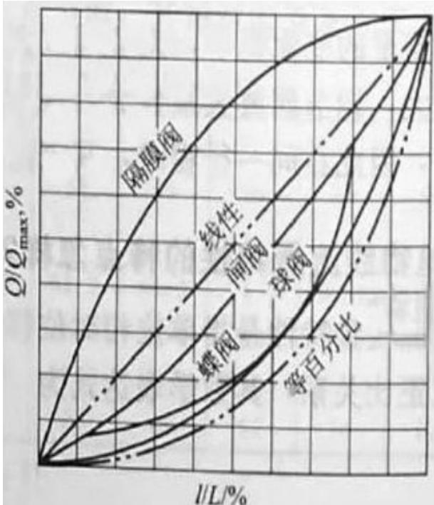

图 25 PID 阀门流量与开度关系曲线

类似情况，不同的输出执行器件，都应该做相应的归一化处理。

注意：PID 系统的时间参照，都应该采用秒为单位。

#### 3.1.4 第三步：建立一个PID模型画像

在完成归一化处理，工程师将有一个统一讨论的基础，而不是讨论具体的多少温度，压力，流量，开度等等。此时在保证工艺生产安全的情况下，工程师应该通过一些尝试，构建出清晰的系统 PID模型的画像。

1. 输入值是线性的吗？

2. 输出值是线性的吗？

3. 过程值为系统允许最大值时，输出值是多少？

4. 输出值给定 5%，过程值的数值是多少？

5. 输出值给定 25%，过程值的数值是多少？

6. 输出值是否允许给出最大值 100%？

7. 输出值为最大值多长时间，过程值会达到最大值？

通过这些尝试，工程师在系统调试前，即可有一个完整的系统响应模型，在调试 PID之前，要确保没有如下问题，否则不要尝试通过 PID 方法解决问题：

1. 输入值/输出严重非线性，无规律剧烈跳变（先确认是否为工艺，仪表，安装等问题）

2. 如果输出值以最小调节单位变动，过程值就有剧烈波动，甚至超调，则意味着出现大马拉小车情况，系统非常难以调节，需要修改工艺设计

3. 类似上一条，如果输出仅为 5%，过程值已经达到 80%，也尽量考虑修改工艺设计

4. 输出值为最大值，但过程值需要很长时间才会发生变化，例如 10 分钟，系统为 4.λ>>1, 大滞后系统，不适合使用 PID控制方法

5. 固定的输出值，得不到确定对应的过程值，系统为非线性系统，不适合使用 PID 控制方法

在排除以上情况后，则系统可以使用 PID控制方法。

#### 3.1.5 第四步：初步建立一个稳定的PID闭环

在通过之前的步骤，确认此系统可以使用 PID 方法后，工程师可以先手动控制输出，给定固定输出值，例如 20%，系统过程值应该逐步趋于稳定，通过观察系统工况，主要了解如下特性：

1. 稳定 PID闭环大概的响应特性，例如阶跃响应

2. 在过程值稳定的情况下，过程值波动是多少？

3. 过程值稳定的情况下，是否存在大的负载，例如供水系统突然出现大的用水用户，过程值会下降多少？

如果有如下情况，需要相应的处理方法：

1. 过程值扰动超出 5%，则应该改进工艺，排除设备故障，考虑增加输入滤波程序，否则在阶跃响应，及继电器法自整定的阶段，都会比较麻烦

2. 突然出现的大负载，尽量不要通过 PID 方法解决，其过程类似于突然给出一个大阶跃的设定值，PID系统会有大的波动，效果一般都不好，尽量通过非 PID 方法解决。自整定的过程也应尽量避开大负载出现的工况。

#### 3.1.6 第五步：PID参数调节

在完成前面四步的工作之后，PID实际工程参数调节已经变得非常简单了，可以参照 2.3、2.5、2.6 章节的内容。

### 3.2 改善系统特性的PID控制策略

通过之前的介绍，工程师已经可以基本完成 PID的参数整定，闭环控制。为了取得更好的系统特性，下面将从控制策略，及关键变量优化（过程变量，设定值，输出量）两个方面进行介绍。

#### 3.2.1 控制策略之一：控制带的使用

在之前的 2.3.3 章节，已经强调了以下内容，此处再次重复强调:

很多工程师在使用传统理论阶跃响应法得到 PID参数后，不结合任何控制策略，就直接在PID控制中使用，例如：在过程变量初始值为 0%时，直接给定一个 80%的设定值。此行为会导致PID过程中的积分饱和，P 分量也会非常大，最终导致输出达到上限（满功率输出），过程变量超出设定值并过冲。此行为不仅仅有一定的工艺危险，对控制设备也是非常不友好的。

工程师此时如果只是把精力投入在修改 PID 参数上，虽然经过反复尝试，最终会发现 PID 参数始终无法满足多设定值工况下的控制要求，从而对 PID 参数整定方法失去信任，甚至对 PID 方法产生怀疑，这些都是错误的。

正确的控制策略：引入控制带策略，可以有效避免积分饱和，大滞后系统的过程值过冲现象

当系统过程变量的初始值距离设定值很“遥远”的时候，不应该直接投入 PID控制策略，应该通过简单的手动，或自动，给出系统可接受的输出值，将过程值逐步调整到接近设定值的某个范围后，再投入 PID 控制。

例如：系统过程变量的初始值为 0%，设定值为 80%，此时不应该直接投入 PID 控制，而应当先将输出值给出一个合适的数值（例如 90%），等待过程值逐渐上升到 60%的时候，再将系统切换到 PID 自动控制，设定值为 80%，参见图 26，（ Kp=1.767，Ti=12，Td=2.4）。虽然对阶跃响应法得到的 PID参数未做任何优化和修正，由于引入了控制带的控制策略，使得系统在多设定值的工况下，都可以得到很好的控制特性。

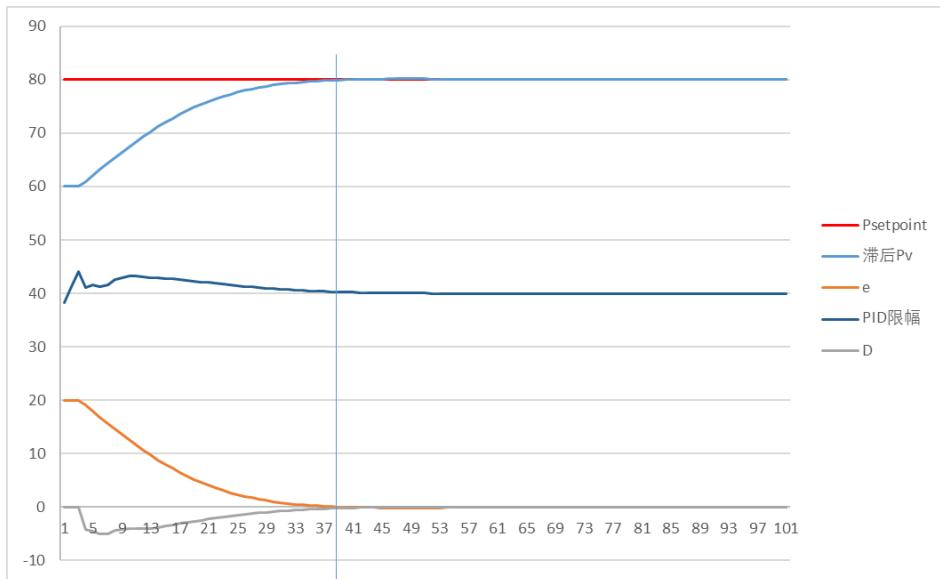  
图 26 引入控制带策略的 PID 曲线

#### 3.2.2 控制策略之二：多组PID参数动态调整

在理想型 PID公式中，只包括了比例，积分，微分三个参数，在部分改进算法中，还会包括它们的占比，或起作用的条件，但即便如此，这些配置也只是满足了它们在系统物理特性不变的情况下的适用性！

解释：当系统物理特性恒定时，可以通过固定的 PID 参数得到在一定范围工况下的理想动态响应，如果系统的物理特性发生改变，则之前的 PID 参数将不适用。

例如：在之前举例的热烘箱系统中，在烘干同等质量的物料时（例如都是 30kg），烘干含水量大的西红柿，与烘干含水量相对少的胡萝卜，系统的滞后时间τ将差异很大；另外一方面，即使都是同一种物料，烘干 30kg 的西红柿，和烘干 60kg 的西红柿，系统的恢复时间 Tg, 也会相差很大，而这两个参数的大幅度改变，就意味着物理模型的改变，PID的参数最终也将有大幅度的改变。

从而，工程师面对这种物理特性会大幅度改变的系统时，如果只使用固定参数的 PID系统，无论怎么调整，最终都不会取得满意的效果。因此，在实际项目中，应该引入多组 PID 参数动态调整控制策略：提前根据可能发生的实际工况，整定多组 PID参数并存储，在设备实际开始加热前，由操作人员输入物料类型及质量数据，再由程序给出合理的加热逻辑并调取相应的 PID 参数进行控制。

#### 3.2.3 控制策略之三：提前准备的 PID系统

首先，任何人都无法预知未来，PID 控制理论也是基于负反馈的控制原理，对系统进行闭环控制，得到相应的动态特性，保持设定值稳定。这种负反馈的机制，就决定了 PID 系统在面对非常大的系统扰动时（例如供水系统突然出现大的用户用水），只能被动得去响应此事件，无法避免系统出现大的波动。

其次，PID三个参数中，虽然微分分量对系统的扰动和趋势可以有相应的响应，但此参数主要用于过程值加速接近设定值时，减缓趋势，防止过冲；对干扰值（一般为小幅度值）有动态响应，快速修正，但微分分量不可以任意加大，否则虽然优化了对大扰动的响应，但高频干扰又会使过程值产生振动，又需要对微分部分加入一阶滤波，实现及调节都比较复杂，参见章节2.2.3。

所以，如果系统中存在比较确定性的大负载，而且系统可以通过时间表，某些输入信号，某些工况条件，可以判断出大负载（也可以是设定值将突然改变）即将发生，则可以先绕过 PID 控制，直接给出一个合理的输出值，等到过程值相对稳定后，再切换到 PID 控制。

#### 3.2.4 关键变量优化之一：过程变量滤波及限幅

PID控制系统关键变量中，过程变量的准确测量，是整个 PID环节的基础，如果不满足此条件，则 PID 无从谈起。

在实际工程项目中，影响过程变量精确测量的情况有很多种，虽然这些情况本身不是 PID的问题，但对 PID控制却影响巨大，例如：

1. 雷达液位计测量液位，但液体表面的泡沫超出了容限

2. 管道非满管状态，短管，湍流，流量计安装不合理

3. 机械振动，电磁干扰导致过程值跳变

4. 仪表量程选择不合理，安装不规范

5. 工艺不合理，必要的硬件配备有问题，供水系统缺少膨胀罐

##### 6. 其它

工程师在调试自控系统之前，务必要尽量解决上述问题，否则 PID 系统调试将非常困难或者失败。

在排除各种不合理因素后，系统过程值也肯定会存在扰动信号，此时需要工程师对此进行相应的处理。

##### 1. 程序相关：输入信号滤波处理

TIA Portal 中提供了多种滤波函数，一阶，二阶，带通，通用类型，用户可以自行查看博途系统帮助文件进行学习，此处仅介绍 Filter\_PT1 一阶滤波函数的 使用。

指令 Filter\_PT1 是具有一阶滞后的比例传递元素，也称为 PT1 元素，可以被用为低通滤波器，用于衰减信号中的高频分量，如噪声。

Filter\_PT1 默认 lag=25s, 也就是说，Filter\_PT1 的输入管脚给定 100%，输出管脚增长到到 63.2%需要 25s。

参见图 27，在开启滤波功能之前，过程变量的扰动非常厉害，从而导致了输出变量的频繁动作，过度的响应。在开启滤波功能后，系统曲线明显“干净”了很多，后续的精确调节过程也得以完成。

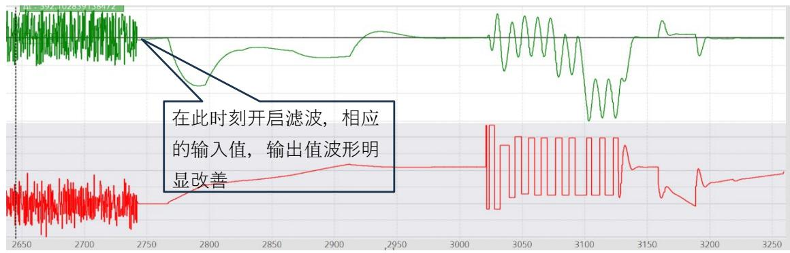  
图 27 引是否开启滤波功能的 PID对照曲线

##### 2. 设置相关：死区设置，输入信号的幅值处理

西门子各个产品线提供的 PID功能块中，提供了死区的设置，这其实也是一种幅值的“过滤”，可以通过手动设置死区宽度来减少输出值不必要的波动。同样可以避免了系统的振动，大幅度延长执行器件的寿命。

#### 3.2.5 关键变量优化之二：过程变量线性化

工程项目中，受制于工艺要求，过程变量的测量值，与期望的归一化值之间可能不是线性关系，这样 PID理论模型的应用就变得缺乏基础。

例如：

储液罐为球形，液位测量的数据与液位不是线性关系，如果直接把液位数据作为过程变量，将对 PID控制调试造成很大困难。

解决方法：

TIA Portal 中提供了 Polyline 函数，此函数可以将输入与输出进行特定曲线映射，映射点可以为 2-50 个点，用户可以自行查看博途系统帮助文件进行学习，通过使用此函数，非线性的过程值，可以被归一化为线性值，从而可以适用于 PID 控制。

#### 3.2.6 关键变量优化之三：设定值给定滤波

在很多工程项目中，工程师往往直接将设定值数值直接给到 PID功能块的输入端，这种做法有一定的弊端，特别是在 PID系统中（P, PI 系统中略好），会导致输出产生一个明显的阶跃响应。

1. 解决方法一：使用 Filter\_PT1 ，并给定一个合理的 lag 值（默认 lag=25s）,例如 1s,把设定值给到 Filter\_PT1 的输入管脚，把此函数的输出管脚数值再给定到 PID 功能块的设定值管脚，这样 PID 设定值就可以得到一个一阶上升曲线的设定值，就可以避免 PID 输出值的剧烈跳变。

2. 解决方法二：使用 RampFunction 函数，相较于 Filter\_PT1 函数的一阶输出特性，此函数可以根据输入管脚的数值，在输出管脚给出线性的斜坡函数值。使用者可以指定输出数值每秒的上升或下降速率。例如，系统 PID 设定值原始值为 0%，现在更改到 70%，参见图 28,可以观察到不使用、使用 RampFunction 函数，RampFunction 函数的三种效果对比。比较而言的，用户可以在 PID 相应速度和是否超调之间，选择一个折衷的方案，得到自己需要的效果。

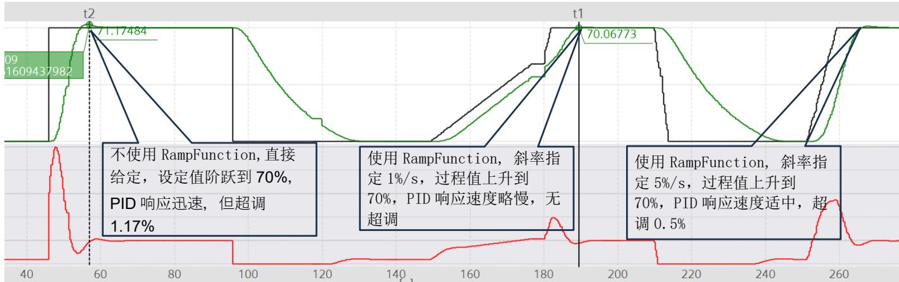  
图 28 斜坡函数的应用效果对比

3. 解决方法三：很多工程师在调试 PID功能时，一般都是使用监视表，然后通过手动给定设定值的方式，进行监控，在工况简单，测试环节少的时候，这种方法是可行的。但是，当需要测试的工艺环节比较复杂，设定值比较多，工程师操作的压力就比较大。这种情况下，工程师可以使用 RampSoak 函数，此函数可以最多组态 50 个设定值点，并且可以指定每个数值维持的时间，通过这个功能，用户可以生成一个输出值，该输出值可构建 PID 给定值多工况时间序列，可以测试最多 50 个数值，而且这些给定值的变化也遵循 Ramp 方式，不会产出跳变。如图 29。

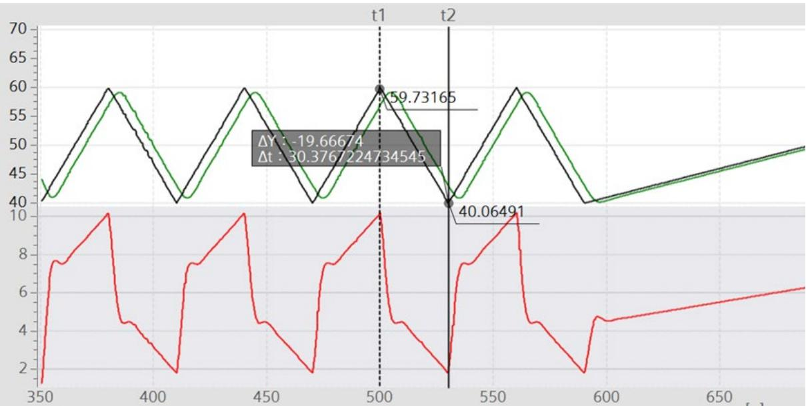  
图 29 PID 多工况测试曲线

#### 3.2.7 关键变量优化之四：输出值平滑处理

与过程变量的采集非常类似，针对于不同的执行器，有些情况下，PID 输出值需要进行平滑处理（也可以认为是低通滤波），通过调用 Filter\_PT1 或 RampFunction 函数，从而减少执行器件的损耗，降低对管路，系统的冲击，具体调用方法此处不再赘述。

例如：蒸汽管道的调节阀门

#### 3.2.8 关键变量优化之五：输出值线性化

工程项目中，受制于执行器件本身特性的限制，其实际执行效果与接收到的控制值并不是线性关系，参见之前章节的图 25，隔膜阀在开度达到 40%的时候，流量已经上升到了 60%，所以如果将 PID 输出值直接连接到执行器件的控制端，PID 理论模型的应用就会出现偏差。为了进行相关的修正，类似于过程变量的线性化，可以使用 Polyline 函数，此处不再赘述。

## 4. 虚拟 PID工程仿真

受制于实际条件，很多工程师缺少实际 PID 工程调试的机会，很多情况下，都是学习 PID 理论后，在现场逐步进行调试的摸索，很难提高 PID调试的效率。

### 4.1 PID 理论仿真工具

本文提供了 PID 理论仿真工具，用户可以自行对其中的数据及参数进行修改，直观高效地完成 PID 理论学习和验证。通过此工具，PID 理论不再是“高深莫测的玄学”，确定性、直观性、便捷性是此工具最大的特点，每一次的参数修改，都不需要漫长的等待过程，调整结果实时地以图形形式进行展现。此工具使得用户可以快速理解 PID理论，验证自己相关的想法，为实际调试打下良好的基础，相关图形可以参照章节 2.2 的内容。

### 4.2 PID工程仿真程序

TIA Portal 中提供了函数 Filter\_PT1, Filter\_PT2, 这两个函数可以作为一阶负载，二阶负载用于 PID仿真调试，本文不做赘述。

但如果希望进行 PID工程项目仿真，这两个函数无法满足下列要求：

1. 仿真 τ ：系统延迟时间，可设置

2. 仿真 Tg: 系统恢复时间，可设置

3. 仿真 λ=τ/Tg，可设置

4. 仿真过程值上升过程，斜率可设置

5. 仿真过程值下降过程，斜率可设置

6. 仿真过程值扰动，可设置

7. 仿真过程值虚拟用户，可设置

本文提供了两个样例程序，

样例程序一：可以实现对 S7-1500/1200 PID 功能仿真，提供一个虚拟物体，实现上述第 1-7项特性功能。

样例程序二：可以实现对 S7-200 Smart PID 功能仿真，提供一个虚拟物体，实现上述第 1-5项特性功能。

#### 4.2.1 虚拟负载的使用基本方法

典型的真实 PLC 控制的 PID 系统框图一般如图 30 所示，工程师进行 PID 测试时，需要真实的 PLC 硬件，输入/输出模块，测量仪表，执行器，真实负载等等 ，涉及到软件，硬件，管路，安装等等。而不同的系统物理特性又相差很大，PID 特性，工艺要求千差万别，给工程师练习 PID控制带来很多的困难。

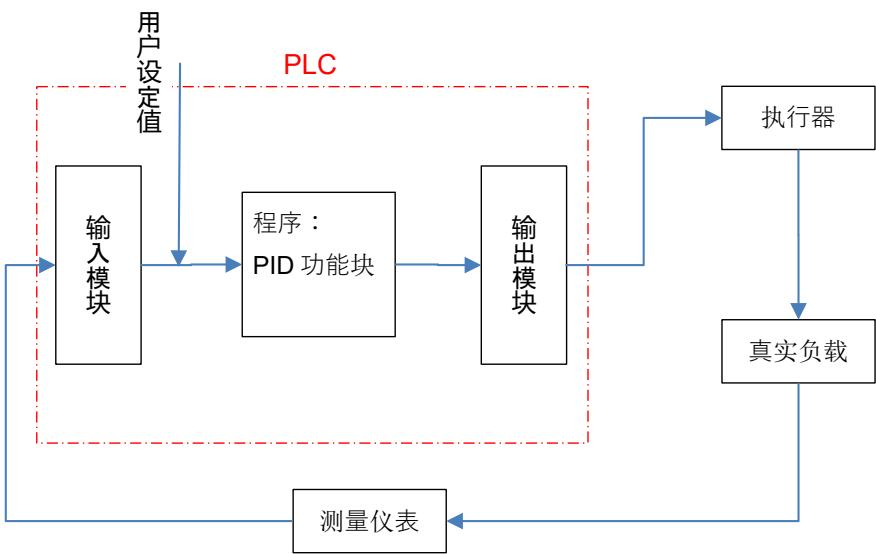  
图 30 典型真实 PLC 控制 PID 框图

为了方便工程师练习 PID 工程调试，本文提供的 PID 工程仿真程序样例一的框图如图 31, 此程序适用与 S7-1500/1200,可以运行在 PLC 中，也可以运行在 PLCSIM 环境中，用户可以将 PIDCompact 功能块通过变量与仿真程序块进行连接：

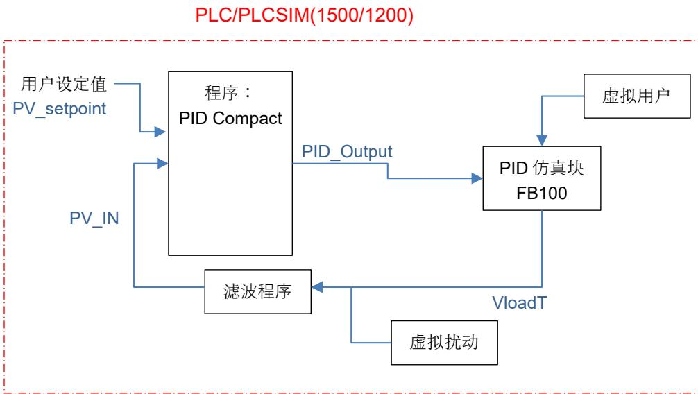  
图 31 PID工程仿真程序样例一框图

本文提供的 PID工程仿真程序样例二只能在 S7-200Smart CPU 中运行，并且没有虚拟扰动和虚拟负载的功能。

用户应尽量以 100ms 为周期，调用此仿真程序，由于 S7-200Smart 中的定时中断 0 及SMB34 会被指定给 PID程序块占用，用户可以使用定时中断 1 及 SMB35 调用此仿真程序。

#### 4.2.1 虚拟负载的参数说明

用户可以通过修改如下参数值，从而改变仿真程序的特性，进而模拟真实负载的物理特性：

1. 仿真 τ ：系统延迟时间，可设置，参数：Gradient

2. 仿真 Tg: 系统恢复时间，可设置，参数：K, Lambda

3. 仿真 λ=τ/Tg，可设置, 参数：Gradient，K, Lambda

4. 仿真过程值上升过程，斜率可设置，参数：K

5. 仿真过程值下降过程，斜率可设置，参数：Lambda

6. 仿真过程值扰动，可设置：虚拟扰动程序

7. 仿真过程值虚拟用户，可设置：虚拟用户程序

<table><tr><td>参数类型</td><td>名称</td><td>数据类型</td><td>默认值</td><td>说明</td></tr><tr><td rowspan="4">Input</td><td>PIDOutput</td><td>Real</td><td>0</td><td>作用于虚拟负载的 PID 输出,</td></tr><tr><td>SetToAmbientT</td><td>Bool</td><td>FALSE</td><td>设置为环境温度</td></tr><tr><td>AmbientT</td><td>Real</td><td>0</td><td>环境温度</td></tr><tr><td>ExternalLoad</td><td>Real</td><td>0</td><td>外部负载</td></tr><tr><td rowspan="3">Output</td><td>VLoadT</td><td>Real</td><td>0</td><td>虚拟负载的当前温度</td></tr><tr><td>Err</td><td>Bool</td><td>FALSE</td><td>错误</td></tr><tr><td>ErrorInfo</td><td>Word</td><td>16#0</td><td>错误代码</td></tr><tr><td rowspan="3">InOut</td><td>K</td><td>Real</td><td>1</td><td>加热系数,PID 输出对虚拟负载的升温影响系数</td></tr><tr><td>Lambda</td><td>Real</td><td>0.01</td><td>散热系数,虚拟负载热量散热到环境当中的系数</td></tr><tr><td>Gradient</td><td>Int</td><td>10</td><td>梯度值,系统延迟时间τ=Gradient*虚拟负载调用 cycle,在τ为定值时,尽量选用大 Gradient,小的 cycle,获得更多的梯度分布,时间连续性;由于 PLC 执行 cycle 的限制,尽量 cycle 最小选为 100ms, Gradient 最大为 100,可得到的τ值最大为 10s</td></tr></table>

表 5 仿真程序块参数表

### 4.3 手动精确调节之参数获得

在之前的 2.6章节中已经讲解 PID 继电器振荡自整定的方法，此方法在 TIA Portal 软件中被称为 PID精确调节，在长时间的整定过程中，如果系统的过程变量还存在大扰动（例如供水系统中出现大的用水用户），整定失败的概率会急剧上升，如果系统工况始终得不到改善，则无法完成整定过程，得不到 PID整定参数。

从大多数的工程实践结果统计来看，继电器法自整定成功的概率还是很高的，但如果出现上面整定失败的情况，如何处理？

#### 4.3.1 S7-1500/1200 精确调节之参数手动获得

本文提供了 S7-1500/1200 PID 精确调节手动参数工具，用户在系统精确调节的过程中，如果出现失败的情况，用户可以手动自行计算并设定 PID精确调节整定参数。不论精确调节是否成功，只要系统能够进入等幅振荡阶段，并出现至少一个完整正弦波波形（由于相对时间较短，不需要完整的过程，所以即使在恶劣的工况下，一个波形也很容易得到），即可根据系统变量值，自行计算 PID参数。

整个过程如下：

• 步骤 1. TIA Portal的 PID工艺对象，在 PID自整定界面中选择 精确调节，并点击Start

• 步骤 2. 将 PID自整定界面中的数据按照实际值填写到整定参数输入区，参见图 32 并填写 PID执行时间

• 步骤 3. 在表 6黄色区域选择 PID 类型

• 步骤 4. TIA Portal的 PID工艺对象，启用手动输入，将推荐参数手动写入到 PID 调试面板的参数区，并下载 PID数据块，参见图 33

备注：推荐参数会和自整定参数略有误差，可以自行调整。

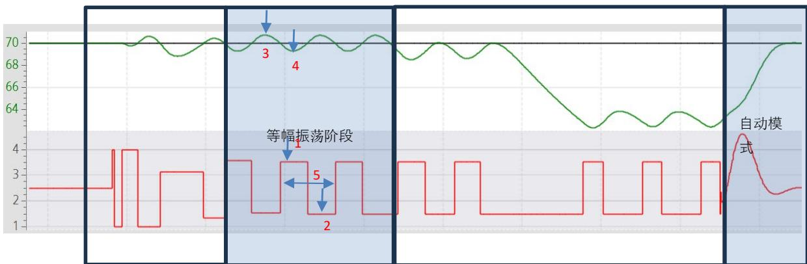  
图 32 S7-1500/1200 精确调节过程曲线关键值选取

<table><tr><td>步骤</td><td></td><td></td><td></td><td></td><td></td></tr><tr><td rowspan="7">1</td><td rowspan="6">整定参数输入区</td><td>参数</td><td>数值</td><td>标号</td><td></td></tr><tr><td>输出方波高值%</td><td>3.53</td><td>1</td><td></td></tr><tr><td>输出方波低值%</td><td>1.49</td><td>2</td><td></td></tr><tr><td>过程值高值%</td><td>70.71</td><td>3</td><td></td></tr><tr><td>过程值低值%</td><td>69.32</td><td>4</td><td></td></tr><tr><td>方波周期s</td><td>18</td><td>5</td><td></td></tr><tr><td></td><td>PID程序执行周期s</td><td>0.1</td><td>6</td><td></td></tr><tr><td></td><td rowspan="2">中间参数</td><td>输出方波幅值%</td><td>1.02</td><td></td><td></td></tr><tr><td></td><td>过程值幅值%</td><td>0.695</td><td></td><td></td></tr><tr><td rowspan="2">2</td><td rowspan="2">控制类型选择</td><td>控制类型选择</td><td>Kp</td><td>Ti</td><td>Td</td></tr><tr><td>自整定 PID</td><td>0.68</td><td>0.58</td><td>0.147</td></tr><tr><td rowspan="2">3</td><td rowspan="2">推荐结果</td><td></td><td>Kp</td><td>Ti</td><td>Td</td></tr><tr><td>最终参数</td><td>1.271</td><td>10.440</td><td>2.646</td></tr></table>

表 6 S7-1500/1200 参数手动计算表

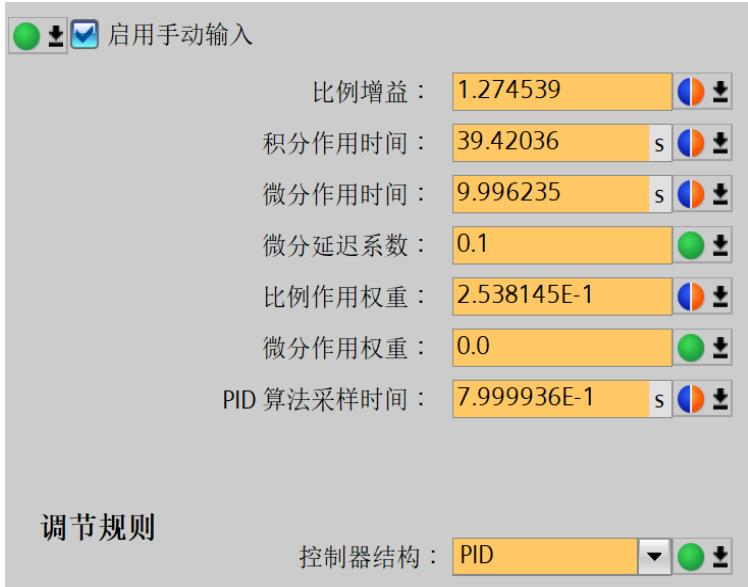  
图 33 S7-1500/1200 PID 调试面板的参数区

#### 4.3.2 S7-200 Smart 精确调节之参数手动获得

本文提供了 S7-200 Smart PID精确调节手动参数工具，用户在系统精确调节的过程中，如果出现失败的情况，用户可以手动自行计算并设定 PID精确调节整定参数。不论精确调节是否成功，只要系统能够进入等幅振荡阶段，并出现至少一个完整正弦波波形，即可根据系统变量值，自行计算 PID参数。

整个过程如下：

• 步骤 1. STEP 7-Micro/Win SMART 中的 PID 整定控制面板中选择 精确调节， 选项中选择 ZN-中，点击启动自整定，参见图 34

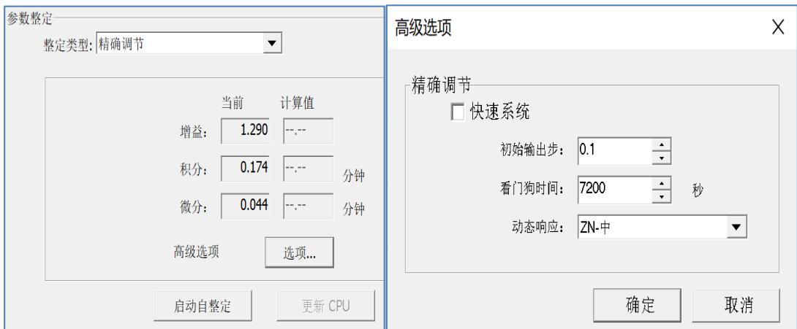  
图 34 S7-200 Smart PID 精确调节类型选择

• 步骤 2. 可以通过观察 PV,OUT数值的实时数据窗口，并按照实际值填写到整定参数输入区，参见图 35

• 步骤 3. 按照 PID向导中的设定填写 PID程序执行时间

• 步骤 4. 在黄色区域选择 PID 类型，200Smart 默认自整定的类型为 PI，

• 步骤 5. 如果希望得到 PID参数，可自行选择 PID 或自整定 PID,参见表 7

• 步骤 6. STEP 7-Micro/Win SMART 中的 PID 整定控制面板中启用手动输入，将推荐参数手动写入到 PID 调试面板的参数区，并点击 更新 CPU，参见图 36

备注：推荐参数会和自整定参数略有误差，可以自行调整。

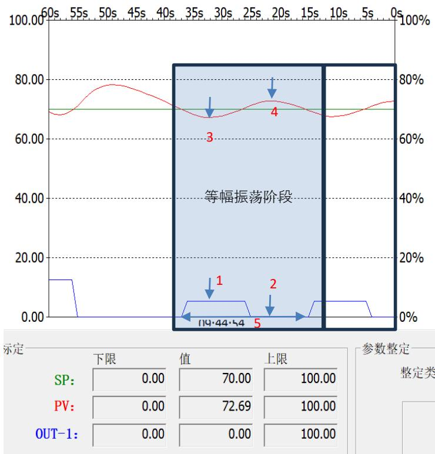

图 35 S7-200 Smart 精确调节过程曲线关键值选取

<table><tr><td>步骤</td><td></td><td></td><td></td><td></td><td></td></tr><tr><td rowspan="7">1</td><td rowspan="6">整定参数输入区</td><td>参数</td><td>数值</td><td>标号</td><td></td></tr><tr><td>输出方波高值 %</td><td>3.53</td><td>1</td><td></td></tr><tr><td>输出方波低值 %</td><td>1.49</td><td>2</td><td></td></tr><tr><td>过程值高值 %</td><td>70.71</td><td>3</td><td></td></tr><tr><td>过程值低值 %</td><td>69.32</td><td>4</td><td></td></tr><tr><td>方波周期 s</td><td>18</td><td>5</td><td></td></tr><tr><td></td><td>PID 程序执行周期 s</td><td>0.1</td><td>6</td><td></td></tr><tr><td></td><td rowspan="2">中间参数</td><td>输出方波幅值%</td><td>1.02</td><td></td><td></td></tr><tr><td></td><td>过程值幅值%</td><td>0.695</td><td></td><td></td></tr><tr><td rowspan="2">2</td><td rowspan="2">控制类型选择</td><td>控制类型选择</td><td>Kp</td><td>Ti</td><td>Td</td></tr><tr><td>PID</td><td>0.6</td><td>0.5</td><td>0.125</td></tr><tr><td rowspan="2">3</td><td rowspan="2">推荐结果</td><td></td><td>Kp</td><td>Ti</td><td>Td</td></tr><tr><td>最终参数</td><td>1.122</td><td>0.150</td><td>0.038</td></tr></table>

表 7 S7-200 Smart 参数手动计算表

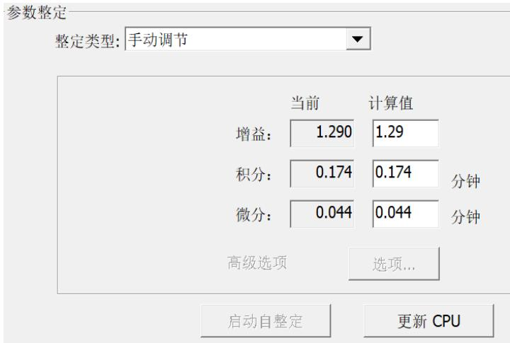  
图 36 S7-200 Smart PID 调试面板的参数区

## 5. 常见问题

Q:那么多的 PID经验参数公式，我该用那个？

A:注意经验二字，既然是经验，就意味着不是公式，没有对错之分，使用者可以借鉴，进行调整，没有必要严格一致。

Q: “理想” 的 PID 参数是否存在？

A: 当然不存在，一套 PID参数只能完成相应物理特性模型下的闭环控制，”万能的，理想的“ PID 参数是不存在的。同样道理，不要把系统、工艺的缺陷，寄托到 PID控制弥补上，例如：PID的输出对过程变量影响极大，即使是最小分辨率的输出改变，都会导致过程量的剧烈波动；超大的滞后系统；采集系统不准确等等。

## 6. 附件工具/程序

1. PID 理论仿真工具 v1.0.xlsx：

用途：学习、验证 PID理论工具

格式：Excel 文件表格

具体功能页签：PID分解、无滞后 PID、常见阶跃响应、预调节阶跃 60输出、预调

节阶跃满输出、预调节阶跃、预调节测试、预调节测试控制带、归一化

2. PID 精确调节手动参数工具 v1.0.xlsx （S7-1500/1200）：

用途：学习、验证 PID精确调节理论，自行计算参数

格式：Excel 文件表格

具体功能页签：根据精确调节特性曲线，测量关键变量值，根据自己的需求，在

PID 精确调节不成功的情况下，自行计算参数

3. PID 精确调节手动参数工具 v1.0.xlsx （S7-200Smart）：

用途：学习、验证 PID精确调节理论，自行计算参数

格式：Excel 文件表格

具体功能页签：根据精确调节特性曲线，测量关键变量值，根据自己的需求，在

PID 精确调节不成功的情况下，自行计算参数

4. PID 工程仿真程序（PID\_vload\_v1.0.zip） （S7-1500/1200）：

用途：学习、验证 PID调节理论，自行设定物理特性，仿真 PID调试

格式：TIA Portal 项目，程序块

具体功能：

A. 仿真 τ ：系统延迟时间，可设置，参数：Gradient

B. 仿真 Tg: 系统恢复时间，可设置，参数：K, Lambda

C. 仿真 λ=τ/Tg，可设置, 参数：Gradient，K, Lambda

D. 仿真过程值上升过程，斜率可设置，参数：K

E. 仿真过程值下降过程，斜率可设置，参数：Lambda

F. 仿真过程值扰动，可设置：虚拟扰动程序

G. 仿真过程值虚拟用户，可设置：虚拟用户程序

5. PID 工程仿真程序（PID\_vload\_v1.0.smart）（S7-200Smart）：

用途：学习、验证 PID调节理论，自行设定物理特性，仿真 PID调试

格式：smart 项目，程序块

具体功能：

A. 仿真 τ ：系统延迟时间，可设置，参数：Gradient

B. 仿真 Tg: 系统恢复时间，可设置，参数：K, Lambda

C. 仿真 λ=τ/Tg，可设置, 参数：Gradient，K, Lambda

D. 仿真过程值上升过程，斜率可设置，参数：K

E. 仿真过程值下降过程，斜率可设置，参数：Lambda

## 7. 参考资料

关于 S7-200 SMART V2.8 版本 PID 功能自整定详细步骤请参考：

S7-200 SMART V2.8 版本 PID 功能自整定指南

关于 S7-200 SMART V2.8 版本 PID 向导功能请参考：

S7-200 SMART V2.8 版本 PID 向导功能指南

关于 S7-200 SMART V2.8 版本 通过 HMI 自整定 PID 参数功能请参考：

S7-200 SMART V2.8 版本 PID 温度整定模板 样例程序

关于 S7-200 SMART V2.8 版本 PID 功能更多信息请参考：

SIMATIC S7-200 SMART 系统手册 V2.8, 08/2023 (A5E03822234-AI)

相关参考网站：

SIMATIC S7-1200, S7-1500 PID 控制

https://support.industry.siemens.com/cs/cn/zh/view/108210036

PID Compact V2 版本 S7-1200 PID 使用

PID Compact V2 版本

S7-200 SMART 官网

https://w2.siemens.com.cn/smart/

PID常见问题

https://www.ad.siemens.com.cn/productportal/prods/s7-200-smartportal/200smarttop/function/PID/PID\_FAQ.html

以前版本的 PID自整定与调试面板

https://www.ad.siemens.com.cn/productportal/prods/s7-200-smartportal/200smarttop/function/PID/PID\_AUTO.html

PID 自动/手动调节的无扰动切换

https://www.ad.siemens.com.cn/productportal/prods/s7-200-smartportal/200smarttop/function/PID/PID\_AUTO\_MANUAL.html

## 8. 更新日志

<table><tr><td>版本&amp;日期</td><td>更新描述</td></tr><tr><td>V1.0.011/2024</td><td></td></tr></table>